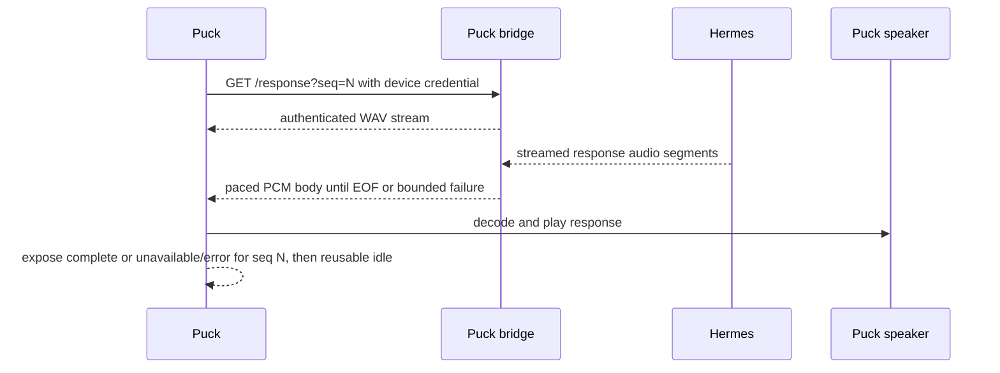

# P-5 validation plan

## Delivery boundary

P-5 covers the response path after a validated Puck capture and before the next reusable wake. The likely implementation surfaces are `puck_bridge/response.py`, `puck_bridge/receiver.py`, `puck_bridge/turn.py`, and the ESPHome response-playback configuration. `pcm_capture.h`, the delivered wake-time acknowledgement ordering, and the Hermes protocol remain unchanged unless a measured failure makes a separate contract change unavoidable.

Terminal-state contract: the bridge may emit successful EOF only after Hermes completion, delivery of all expected PCM, and response-queue drain. A failure before headers uses an HTTP error; a failure after streaming begins records `unavailable` for the same sequence. After media-player idle, the Puck queries authenticated `GET /response-status?seq=N`; `complete` is a no-op, while `unavailable` aborts remaining playback, reports the error locally, and returns the device to reusable idle. The status carries no audio or transcript text and expires after the next sequence or a bounded short TTL.

## Measurements

Accounting uses one normalized boundary: the source is the concatenated Hermes PCM payload before WAV encoding; delivered audio is the bridge PCM payload after removing WAV and HTTP framing and before the device's 24 kHz-to-48 kHz resampler. Compare exact byte counts and SHA-256 fingerprints, and calculate both durations as `bytes / (24000 * 1 * 2)`.

Every probe should record:

| Metric | Purpose |
|---|---|
| Source PCM bytes, duration, and SHA-256 | Establish the complete normalized response payload. |
| Delivered PCM bytes, duration, and SHA-256 | Detect silent truncation or alteration before device resampling. |
| Time to first audio | Preserve the roughly four-second v1 working target where possible. |
| Producer timestamps and inter-chunk gaps | Identify upstream hesitation and test recoverable-gap boundaries at 19.9, 20.0, and 20.1 seconds. |
| Consumer timestamps and observed playback rate | Establish whether the device drains faster than the bridge produces. |
| Queue depth and high-water mark | Prove queued PCM never exceeds 480,000 bytes and characterize backpressure. |
| Reader timeout, playback state, and terminal reason | Distinguish complete playback, underrun, stream failure, and clean-but-early `IDLE`; verify prompt header and definitive EOF behavior. |
| Hardware audio observation and next-wake result | Prove audible completion, Mac silence, and reusable post-playback state. |

## Test sequence

1. Add or update fakes around the existing response stream so a known PCM fixture of at least 20 seconds spanning at least two Hermes audio segments can be delivered at recorded live cadence with a real-time consumer, faster-than-real-time pace, fixed-length framing, chunked framing, gaps of 19.9, 20.0, and 20.1 seconds, a terminated connection, and a delayed first audio body. A response that produces no audio before streaming begins uses the existing pre-header HTTP error path.
2. Measure the current normal-rate path before changing prebuffer, queue limits, or timeouts. Preserve the failing fixture if it reproduces the clean early `IDLE`, including its producer cadence, consumer rate, and inter-chunk gaps.
3. Select and implement the bounded producer/consumer policy within the 480,000-byte queued-PCM cap. A full queue must apply asynchronous backpressure without dropping or replaying PCM; if consumer progress does not resume within the 20-second stall budget, mark the response `unavailable`. Gaps under 20 seconds remain recoverable without EOF. The policy must also define queue ownership, prompt header timing, definitive stream termination, and the terminal state exposed to the device.
4. Add focused regression coverage in `tests/test_puck_bridge.py` and the relevant firmware/source checks. Prove full byte consumption, both framing modes, bounded failure, single-consumer behavior, clean sequential reuse, and media-task-owned non-blocking playback setup.
5. Run the controlled hardware gate with a representative long response: wake, capture, upload, hear the entire response from the Puck, confirm the Mac is silent, confirm no premature `IDLE`, and perform a second wake.
6. Run the focused tests, then `venv/bin/pytest` from the repository root. Record the fixture sizes, pacing, queue high-water mark, terminal outcome, device build identity, and hardware observation with the validation result.

## Acceptance gates

- Host tests pass for normal, accelerated, fixed-length, chunked, temporary-gap, genuine-failure, duplicate-fetch, and subsequent-response cases.
- The bridge never exceeds 480,000 queued PCM bytes under a slower consumer; full-queue behavior applies asynchronous backpressure, never drops or replays PCM, and becomes `unavailable` after the bounded stall budget.
- A 19.9-second active gap remains recoverable without EOF; a 20.0- or 20.1-second gap becomes `unavailable` and reaches the Puck through `/response-status?seq=N`.
- The device reports unavailable/error rather than successful completion when delivery cannot continue.
- A controlled ESPHome compile and hardware run prove the same response is audible through the Puck speaker to EOF and that wake detection remains usable afterward.
- No raw audio, response transcript archive, credential, or machine-specific capture is added to the repository.
