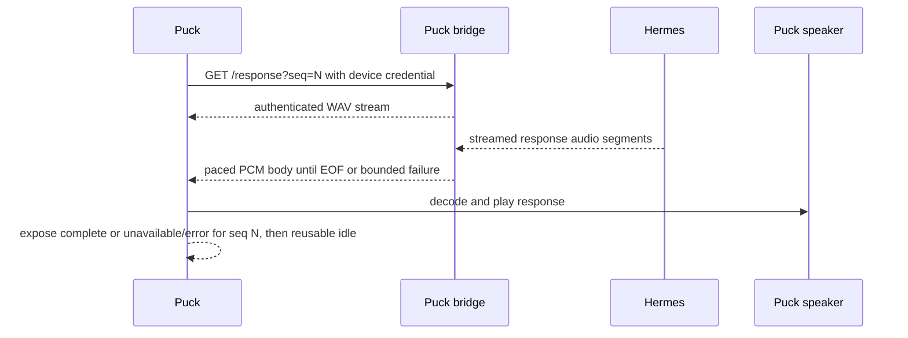

# P-5 validation plan

## Delivery boundary

P-5 covers the response path after a validated Puck capture and before the next reusable wake. The likely implementation surfaces are `puck_bridge/response.py`, `puck_bridge/receiver.py`, `puck_bridge/turn.py`, and the ESPHome response-playback configuration. P-5 owns Hermes/bridge/HTTP pacing, queue, and stream terminal behavior; P-11 owns low-level speaker callback, preload, channel-enable, queue, DMA, and output-state failure propagation. `pcm_capture.h`, the delivered wake-time acknowledgement ordering, and the Hermes protocol remain unchanged unless a measured failure makes a separate contract change unavoidable.

## Terminal contract

The bridge may emit successful EOF only after Hermes completion, delivery of all expected PCM, and response-queue drain. A failure before headers uses an HTTP error; a failure after streaming begins records `unavailable` for the same sequence.

After media-player idle and before wake detection resumes, the Puck queries authenticated `GET /response-status?seq=N&token=...`. A known terminal response returns HTTP 200 with exactly `{"seq": N, "status": "complete"}` or `{"seq": N, "status": "unavailable"}`. An unknown or expired sequence returns 404, and an active sequence returns 409. `complete` clears response state; `unavailable` aborts and clears remaining response playback, plays `refused_sound` once, reports the error locally, and returns the device to reusable idle.

Retry 409 every 250 ms for no more than 2 seconds. Treat 404, timeout, or authentication failure as `unavailable`. Retain terminal status for 60 seconds or until the next sequence begins; never fall back to the latest sequence. The status carries no audio or transcript text.

## Accounting boundary

Use one normalized accounting boundary. The source is the concatenated Hermes PCM payload before WAV encoding. Delivered audio is the bridge PCM payload after removing WAV and HTTP framing and before the device's 24 kHz-to-48 kHz resampler. Compare exact byte counts and SHA-256 fingerprints. Calculate both durations as `bytes / (24000 * 1 * 2)`.

## Measurements

Every probe should record:

| Metric | Purpose |
|---|---|
| Source PCM bytes, duration, and SHA-256 | Establish the complete normalized response payload. |
| Delivered PCM bytes, duration, and SHA-256 | Detect silent truncation or alteration before device resampling. |
| Capture-end-to-first-spoken-audio | Prove the normal fixture's median is at or below four seconds. |
| Response-admission-to-first-PCM | Separate bridge/device response latency from Hermes and capture latency. |
| Producer timestamps and inter-chunk gaps | Identify upstream hesitation and test recoverable-gap boundaries at 19.9, 20.0, and 20.1 seconds. |
| Consumer timestamps and observed playback rate | Establish whether the device drains faster than the bridge produces. |
| Queue depth and high-water mark | Prove queued PCM never exceeds 480,000 bytes and characterize backpressure. |
| Reader timeout, playback state, and terminal reason | Distinguish complete playback, underrun, stream failure, and clean-but-early `IDLE`; verify prompt header and definitive EOF behavior. |
| Hardware audio observation and next-wake result | With Mac playback disabled, use a temporary external microphone and the defined fixture end marker to prove audible completion and reusable post-playback state; discard the capture after extracting metrics. |

The trace record is one bounded record per `seq`, with timestamps monotonic from response admission. It contains only the fields listed above plus fixture and firmware identifiers; it contains no PCM, transcript, prompt, response text, or unbounded event history. The hardware fixture appends a test-only 240 ms end marker: 80 ms at 880 Hz, 80 ms at 1,320 Hz, and 80 ms at 1,760 Hz, with 20 ms crossfades and a -18 dBFS peak. A normalized matched-correlation detector passes at `>= 0.8` when the marker appears once within +/- 500 ms of the expected end after measured output latency is accounted for.

## Test sequence

1. Add or update fakes around the existing response stream so a known PCM fixture of at least 20 seconds spanning at least two Hermes audio segments can be delivered at recorded live cadence with a real-time consumer, faster-than-real-time pace, chunked framing through `/response`, fixed-length framing through a static fixture at the Puck decoder boundary, gaps of 19.9, 20.0, and 20.1 seconds, a terminated connection, and a delayed first audio body. Include framing-corruption cases: fixed-length bodies shorter and longer than `Content-Length`, malformed or early-terminated chunks, and bytes after the chunk terminator. Include deterministic interleavings where the final PCM write races normal completion, stall expiry, or failure, followed by a new sequence. A response that produces no audio before streaming begins uses the existing pre-header HTTP error path.
2. Measure the current normal-rate path before changing prebuffer, queue limits, or timeouts. Preserve the failing fixture if it reproduces the clean early `IDLE`, including its producer cadence, consumer rate, and inter-chunk gaps. Use the timing, reader, CPU, and playback-task measurements to test the pacing/backpressure hypothesis rather than assuming it.
3. Select and implement the bounded producer/consumer policy within the 480,000-byte queued-PCM cap. A full queue must apply asynchronous backpressure without dropping or replaying PCM; if consumer progress does not resume within the 20-second stall budget, mark the response `unavailable`. Gaps under 20 seconds remain recoverable without EOF. The policy must also define queue ownership, prompt header timing, definitive stream termination, and the terminal state exposed to the device. Serialize the final PCM write with terminal selection, drain it before successful EOF, and ensure a completed stream cannot be downgraded by a concurrent stall check.
4. Add focused regression coverage in `tests/test_puck_bridge.py` and the relevant firmware/source checks. Prove full byte consumption, both framing modes, framing-integrity rejection, bounded failure, the final-write/terminal interleavings, success-only chunk termination, the sequence-ownership table for duplicate/stale/future/terminal/late writes, single-consumer behavior, clean sequential reuse after each framing failure, and media-task-owned non-blocking playback setup.
5. Run the controlled hardware gate with a representative long response: wake, capture, upload, hear the entire response from the Puck, disable Mac playback, use a temporary external microphone to detect the defined 240 ms end marker with normalized matched correlation `>= 0.8` within +/- 500 ms of the expected end after measured output latency, confirm no premature `IDLE`, measure median capture-end-to-first-spoken-audio at or below four seconds, discard the capture after extracting metrics, and perform a second wake.
6. Run the focused tests, then `venv/bin/pytest` from the repository root. Record the fixture sizes, pacing, queue high-water mark, terminal outcome, device build identity, and hardware observation with the validation result.

## Acceptance gates

- CAP-1: Host tests pass for normal, accelerated, chunked, temporary-gap, genuine-failure, duplicate-fetch, and subsequent-response cases; the Puck decoder boundary passes the fixed-length static-fixture case.
- CAP-1/CAP-2: Fixed-length short/long bodies and malformed, early, or trailing chunked bodies never produce successful EOF; each becomes `unavailable`, rejects excess/late bytes, and leaves the next sequence clean.
- CAP-1/CAP-2: Final PCM and terminal transitions are serialized. The final queued bytes are delivered before successful EOF, a completed stream cannot become a stall, and only `complete` emits the chunk terminator. Failure paths close as `unavailable` and do not send a success terminator.
- CAP-1/CAP-2: The bridge never exceeds 480,000 queued PCM bytes under a slower consumer. Full-queue behavior applies asynchronous backpressure, never drops or replays PCM, and becomes `unavailable` after the bounded stall budget.
- CAP-1/CAP-2: A 19.9-second active gap remains recoverable without EOF; a 20.0- or 20.1-second gap becomes `unavailable` and reaches the Puck through `/response-status?seq=N`.
- CAP-2: Duplicate, stale, future, terminal, and late-write sequence cases preserve one response owner, prevent replay, and leave the next sequence clean.
- CAP-2: `/response-status` returns only the requested sequence's terminal state with the defined 200/404/409 semantics and 60-second retention; it never falls back to another sequence.
- CAP-2: After media-player idle, firmware checks status before wake restart. It retries 409 within the 2-second bound, plays one `refused_sound` for `unavailable`, 404, timeout, or authentication failure, and leaves no response PCM pending.
- CAP-2: The device reports `unavailable` or error rather than successful completion when delivery cannot continue.
- CAP-1/CAP-3: A controlled ESPHome compile and hardware run, with Mac playback disabled and an independent temporary acoustic observer, detect the defined 240 ms end marker once at normalized matched correlation `>= 0.8` within +/- 500 ms of the expected end after measured output latency, prove the same response is audible through the Puck speaker, and prove wake detection remains usable afterward; the observer capture is discarded after metrics extraction.
- CAP-1/CAP-3: The normal hardware fixture reaches first spoken audio at a median of four seconds or less from capture end; response-admission-to-first-PCM is reported separately with any exception attributed.
- No raw audio, response transcript archive, credential, or machine-specific capture is added to the repository.
